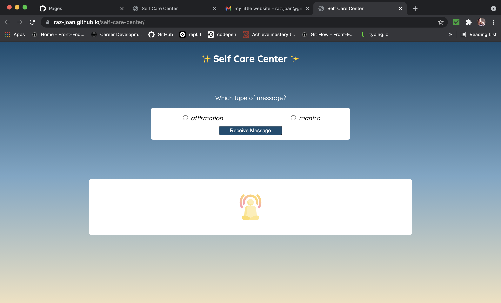
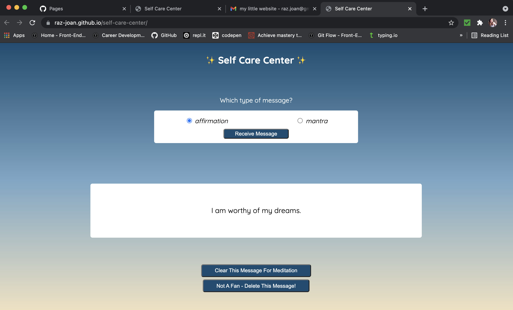
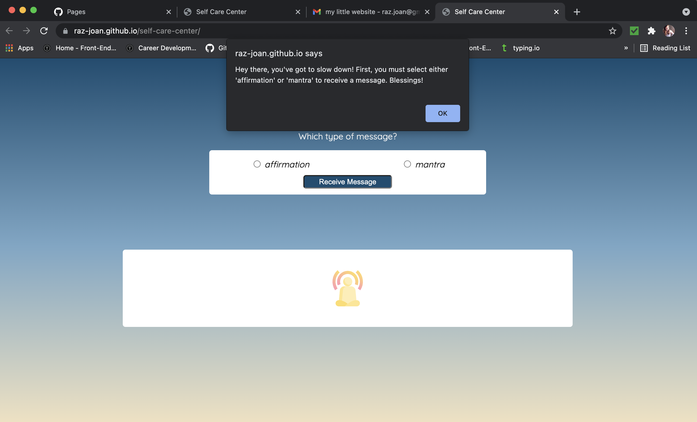
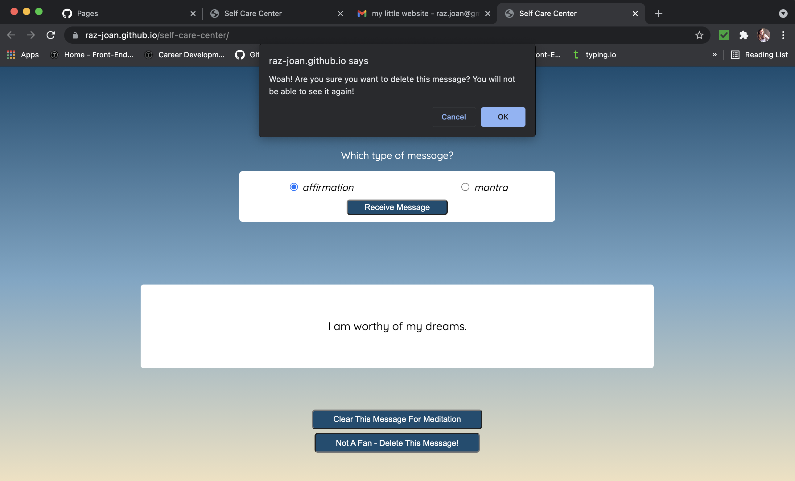

# Self Care Center

## Description
How can I care for myself? One way is with affirmations and mantras! Affirmations are thoughts of positive self-empowerment, meant to assert your self-worth. Mantras are repetive phrases that are repeated again and again during mindfulness practices. This application helps users remind themselves of their inherent value!

The goals of this solo project were to:  
- Use HTML and CSS to build an application to match a provided comp  
- Use JavaScript, build out functionality so that the user can:  
  - select to receive a random message that is either an affirmation or a mantra  
  - use error handling to ensure a selection is made before the receive message button can be clicked  
  - build a clear button to remove the current message and replace it with the bell meditation icon  
  - build a delete button to remove the current message from the correct array so that it will not be seen again  
  - use error handling to warn the user in some way that the message will be removed permanently

## Illustrations  
Landing Page
  

Receive Message
  

No Selection Alert
  

Delete Message Confirmation
  

## Technologies Used
HTML, CSS, and JavaScript

## Collaborators
[Joan Rasmussen](https://github.com/raz-joan) - Project Programmer  
[Heather Faerber](https://github.com/hfaerber) - Project Manager / Instructor  

## Find this project [here](https://raz-joan.github.io/self-care-center/).  

## Find the spec sheet for the project [here](https://frontend.turing.io/projects/module-1/self-care-center.html).

## To complete this same project, go [here](https://github.com/turingschool-examples/self-care-center) and follow the setup instructions.
